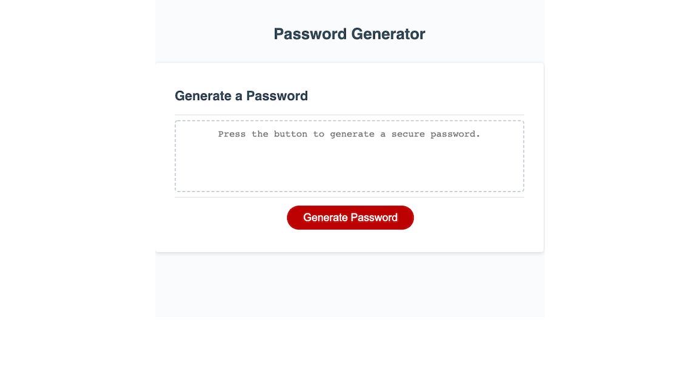
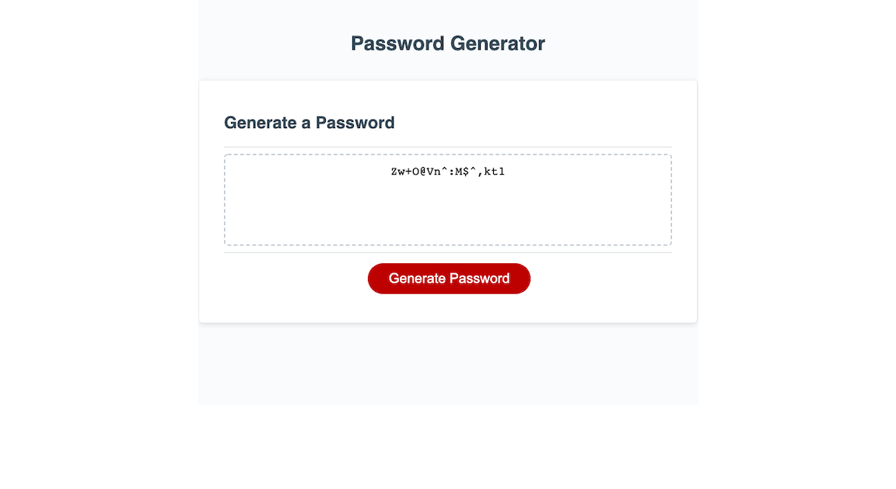

# 3. JavaScript Challenge: Password Generator

## Description

This application is a random password generator that was developed using JavaScript. After clicking the "Generate Password" button, the user is shown a series of prompts asking for the desired password length and the desired character types to be used in the password from among uppercase, lowercase, numbers, and special characters. In order to generate a random password,the application stores the characters specified by the user in an array then randomly selects characters from that array according to the users desired password length. The password is then displayed to the user on the webpage using the DOM api.

## Deployment

You can visit my live portfolio [here](https://aidanamato.github.io/password-generator/).

## Credits

[Starter Code](https://github.com/coding-boot-camp/friendly-parakeet): UCF Coding Bootcamp

## License

[MIT](./License.txt)